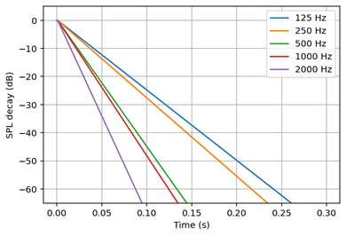
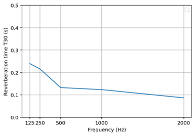

# Summary

Studying the acoustic properties of enclosed spaces is important for improving the quality of environments and reducing noise induced health effects. With the rise of numerical room acoustics modelling, tools have been developed that are both computationally efficient and versatile in capturing sound behaviour in enclosed spaces. `acousticDE` is an open-source software for simulating room acoustics using the diffusion equation approach. The software is designed to be easy to use and suitable for research applications, consultancy work and educational purposes. In practice, it can be used for evaluating design choices during early architectural design stages, optimising acoustic treatment layouts or testing performance of rooms intended for speech, music or general occupancy.

The method implemented in `acousticDE` - the diffusion equation method - has gained considerable interest because it offers efficient calculations and is flexible with regards to the type of spaces to be addressed. To simulate the sound field in a room, `acousticDE` requires a digital 3D model of the geometry, as well as material properties describing the acoustic boundaries. Once configured, `acousticDE` can incorporate sound sources, compute the distribution of sound energy throughout the space, and provide key room acoustics parameters relevant to practical acoustic assessments. 

# Statement of need

Room acoustics simulation is essential for researchers and for consultants to accurately predict and design the acoustics inside a room. However, existing methods often face a trade off between accuracy, transparency in the calculation method, and software and computational efficiency. Traditional statistical methods, such as the Sabine and Eyring calculations, provide a fast global estimate of the acoustic parameters, but these are based on unrealistic assumptions that are only valid for certain rooms and for certain frequency range [@Kuttruff2019RoomAcoustics]. More accurate approaches area available including both commercial and open-source software. However, commercial tools often lack transparency, as it is difficult to understand how the calculations are performed internally. These are mostly based on common approaches for running high frequency simulations, i.e. geometrical acoustics methods. Additionally, full wave-based approaches can achieve higher accuracy but require significant computational resources, making them impractical for larger spaces. These motivations create two gaps: the accuracy/efficiency gap and the transparency gap. For the first, there are non accurate simple tools against accurate computationally expensive softwares. For the second, there are closed source tools against open source ones.

`acousticDE` was developed to address both these gaps. It is an open-source software package designed for the simulation of room acoustics using the diffusion equation model (DE), targeting researchers, consultants and educators who require a transparent and efficient method to high-frequency room acoustics.

# State of the field

The diffusion equation model has grown to be an effective compromise for room acoustics simulations in the high frequency range, providing physically meaningful spatial and temporal distributions of acoustic energy while remaining computationally efficient [@Foy2016IncludingApproach;@Mou2023AnSpaces;@SuGul2020ComparativeStations]. However, despite its demonstrated usefulness in the literature, accessible and user-friendly open-source software implementations of the diffusion equation model do not exist [@Hornikx2024] or are somewhat limited. In fact, most implementations of the diffusion equation are embedded in commercial tools (e.g. COMSOL or Femlab toolbox for Matlab), where room acoustics simulation are not the primary focus. An additional open source implementation exists, but it is currently at its initial experimental stage, lacks documentation and is written in GNU programming language [@univgustaveeiffel]. 

Compared to the available softwares, `acousticDE` distinguishes itself by providing two different numerical methods for implementing the diffusion equation within a Python programming environment: the Du Fort&Frankel Finite Difference Method (FDM) [@Navarro2012ImplementationRooms] and the Finite Volume Method (FVM) [@PaganMunoz2019NumericalMethods]. The FDM can be used for parallelepiped shapes and the room is discretised into a 3D grid of points where the energy density is calculated. The FVM can be used for any 3D geometry, since the discretization is with tetrahedrical elements. The dual approach allows the user to select the appropriate balance between flexibility and efficiency, depending on the room type and the dimension of the discretization. Compared to other methods for the high frequency range - e.g. pyroomacoustics [@Scheibler2018] and sound particle tracing [@ISimpa2012]- , the DE model is easy to use and understand and has a low computational speed, allowing users to quickly simulate room acoustic problems. However, for complex non-proportional geometries or highly absorptive spaces, the diffusion equation does not reach the level of accuracy of more detailed (but computationally more costly) acoustics methods (geometrical acoustics or wave-based method). It is instead accurate for compact spaces with high reflective surfaces. `acousticDE` allows for the calculation of common room acoustics parameters. Beyond numerical simulation, `acousticDE` enables the creation of the impulse response from the numerical results of the diffusion equation and auralization, allowing users to generate perceptual audio demonstrations of acoustic conditions. In addition, the software is accompanied by well-structure and comprehensive documentation. 

# Method

The diffusion equation method, originally introduced by Ollendorff [@Ollendorff1969AbsorptionWaves] and later refined [@Picaut1997AEquation], overcomes some of the limitations of statistical room acoustics, which is grounded in the diffuse field assumption [@Sabine1922CollectedAcoustics]. Compared to wave-based approaches [@Hamilton2017FDTDTime;@Wang2019RoomMethod], ray- and beam-tracing algorithms [@Kuttruff2019RoomAcoustics], or the image source method [@Kuttruff2019RoomAcoustics], the DE method provides a computationally lightweight software for room acoustics simulations, research and practice. The method is more accurate than Sabine's or Eyring's statistical methods and suitable for quick estimates of room acoustics parameters.

The diffusion equation method aims to estimate how acoustic energy is distributed over time and space within a specific room. The modelling method is based on solving the partial differential diffusion equation, which is applicable in the high-frequency range and it assumes only diffusely reflecting boundaries following Lambert's law [@Valeau2006OnPrediction]. The diffusion equation method is based on the energetical approach, where sound has undergone multiple reflections and scattering in an environment. It represents the late stage of wave propagation, where the energy, after being reflected multiple times, is spread out across the space, following the diffusion process of gas and heat in a medium. The method has some limitations, e.g. diffraction is not taken into account, the early decay is not included, surfaces are assumed fully scattering and the method is not accurate for average high absorption coefficients. The method includes, though, the most common physical phenomena for room acoustics: surface absorption, atmospheric absorption and diffusion.

The diffusion equation together with its boundary condition reads as follows:

$$
\frac{\partial{w(\mathbf{r}, t)}} {\partial{t}} = - D \boldsymbol{\nabla}^2 w(\mathbf{r}, t) - m c w(\mathbf{r}, t) + q(\mathbf{r}, t) 
$$

$$
-D \dfrac{\partial w}{\partial n} = h w
$$

where $w(\mathbf{r}, t)$ is the energy density at each position $\mathbf{r}$ and at time $t$, $m$ is the atmospheric attenuation coefficient, $c$ is the speed of sound, $q(\mathbf{r}, t)$ is the source term and $h$ is the boundary absorption term. Several methodologies propose expressions for $h$ based on different assumptions on how to treat the suface absorption coefficients of the room [@Picaut2002NumericalProcess;@Jing2007APredication;@Jing2008OnExperiments]. The diffusion coefficient $D$, with units m$^2$/s, indicates how quickly sound diffuses around the room. This depends on the mean free path of the room.

From the energy density, the reverberant field Sound Pressure Level (SPL) can be calculated as follows: 
$$
\text{SPL}(\mathbf{r},t) = 10  \log_{10} \left(\frac{\rho c^2 w(\mathbf{r},t)} {p_{\text{ref}}^2}\right) 
$$
where $\rho$ is the density of air in [kg/m$^3$] and $p_{\text{ref}}$ is equal to $2 \times 10^ {- 5}$ Pa [@Navarro2015].

This method allows to calculate acoustics parameters in the room (e.g. sound pressure level and reverberation time). Example results are shown in the figure below.

**(a)** SPL decay                                        **(b)** T30 vs frequency

# Software design

## Design trade-offs
The design of `acousticDE` is based on a set of architectural choices shaped by the needs of room acoustics simulation research: (1) transparency, (2) reproducibility and (3) method-centric modularity. The software is implemented in Python, since it is open-source and widely accessible compared to licensed tools, i.e. Matlab. In addition, it is an easier and more understandable language for researcher and for users from different fields compared to lower level languages such as C++ and Fortran.

**Method-centric modularity vs unified solver abstraction:** Rather than implementing a single abstract solver interface, `acousticDE` is organised around self cointained modules: FDM, FVM and Auralization. Each module exposes a single functional API like 'run_fvm_sim(...)' and maintain its own internal workflow. This structure has been chosen to mirror how acoustics researchers and consultants conceptualise simulation workflows and for simplicity. This design choice prioritize clarity and transparency compared to regid, extensible structural organization of the software. Each user can inspect, modify, validate each method independently, and compare the results with other methods. 

**Workflow design vs monolithic simulation engine:** `acousticDE` adopts a functional, sequential pipeline rather than an object-oriented architecture. As an example, the FVM and Auralization pipelines are shown, as these represents the most structurally demanding workflow. 

1. creation of the 3D geometry;
2. meshing of the geometry;
3. specification of inputs parameters;
4. execution of the acoustics diffusion equation simulator;
5. execution of the auralization module, based on the results of point 4.

When using the FDM and Auralization modules, the first two steps of the above list can be skipped.

This pipeline was intentionally chosen to make each stage of the modelling process explicit and inspectable. Room acoustics simulators are highly sensitive to early-stage modelling errors, such as gaps in the geometry, incorrect surface definitions or inconsistent material properties. By decomposing the workflow into clear steps, the user is encouraged to verify the geometry, inspect the mesh and validate the physical inputs before committing to the simulation. The design aligns with the goal of making the modelling process explicit rather than hiding behind a 'black box'. 

**Functional decomposition vs object-oriented framework:** Simulations are executed via a single function call. Each module main simulation engine (point 4 of the pipeline before mentioned) is organised in a set of modular, sequential function calls. Each function has its own task and returns data that are needed by the next function in the next stage of the simulation. The main siulation is therefore decomposed into subtasks, each of which provides services to the next layer. This functional decomposition improves readability and support maintainability. 

**Array based data structure vs custom simulation objects:** The core data structure used throughout the software are data structures, such as arrays, matrices and vectors. Arrays are stored in dense formats using Numpy and in sparse format using scipy. This choice refelcts the mathematical and numerical formulation of the diffusion equation where discretised fields and time-stepping schemes are naturally represented by arrays. Mesh information imported from Gmsh is also stored as arrays, maintaining the consistency. In some cases, Python dictionaries appear - e.g. grouping material properties - but do not affect the computational efficiency of the software, since the bulk of the computation is performed using Numpy arrays that support vetorization and multithreading. These data structures allow computationally efficient numerical operations and linear algebra computations, following a direct correspondence between mathamtical formulation and implementation.

## Architecture

Due to the simplicity of the diffusion equation method, the `acousticDE` software architecture deliberately avoids heavy abstraction or complex class hierarchies, which would only increase the complexity of the codebase. Instead, the simple and transparent architecture provides flexibility for modifications, debugging, adding new functionalities together with the possibility for experimenting with different inputs, materials and simulation scenarios. The readability and explicit algorithmic architecture make the software appropriate for reproducible research but also for teaching, where the clarity of implementation is necessary. While the software is developed as a stand-alone project; its architecture, allows for potential future integration or coupling with other tools (such as image source method for the early part of the decay), providing that a common input generation framework is used.

## Software validation

Over the years, the design of `acousticDE` software has improved and functionalities have been added. 
Results of the software have been validated against results from literature, with comparison between FDM and FVM results and other external methods and via auralization experiments. To complement the validation of the numerical results, the software was also profiled to assess its computational behaviour and improve performance.

# Research impact assessment

The software can be used as a standalone simulation tool or as a back-end acoustic simulator of the Community Hub for Open-source Room Acoustics Software [CHORAS](https://github.com/choras-org/CHORAS) [@Willemsen2025]. The software has already been applied in a number of scientific publications [@Fichera2024DeterminationApproach;@Fichera2025;@Fichera2026AnRooms] and graduate-level teaching at the Eindhoven University of Technology (TU/e), where it has proven valuable for understanding the impact of room geometry and material absorption on acoustic behavior and for designing rooms from an acoustics point of view. By combining ease of use and computational efficiency, `acousticDE` fills a critical need for researchers, consultants, and educators seeking a practical, transparent and approximate tool for room acoustics simulation.

# AI usage disclosure

No generative AI tools were used in the development of this software, the writing of this manuscript, or the preparation of supporting materials.

# Acknowledgements and Fundings

The authors acknowledges contributions from Silvin Willemsen, Marco Berzborn, Hassan Teymoori, Amin Livani, Felipe Raymann, and Radovan Bast.

This research is funded by the Dutch Research Council (NWO), Applied and Engineering Sciences (AES) under grant agreement No. 19430, with project title 'A new era of room acoustics simulation software: from academic advances to a sustainable open-source project and community'.

# References
